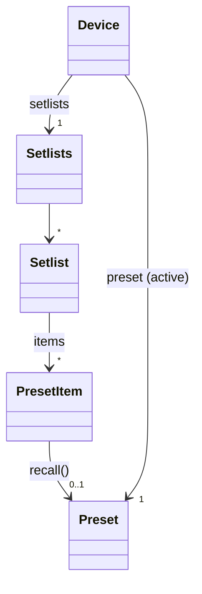
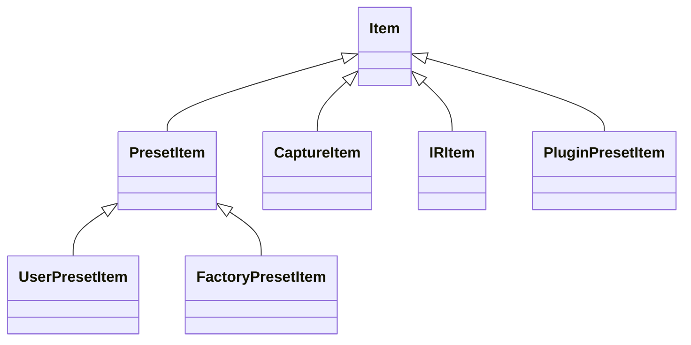
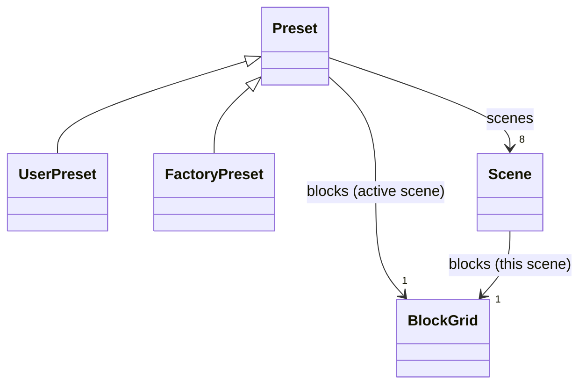
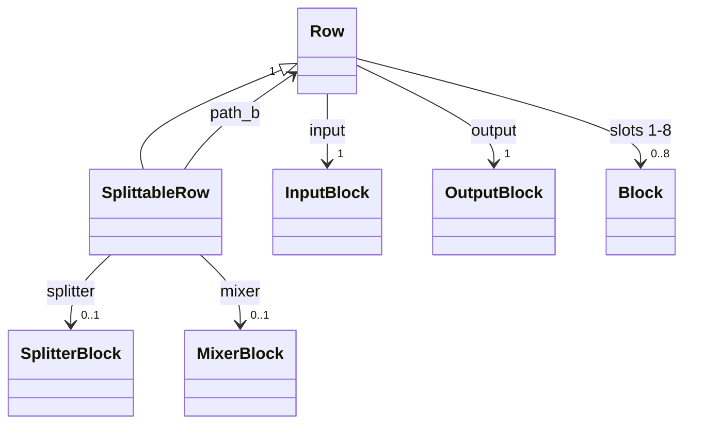
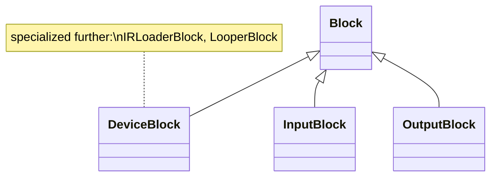
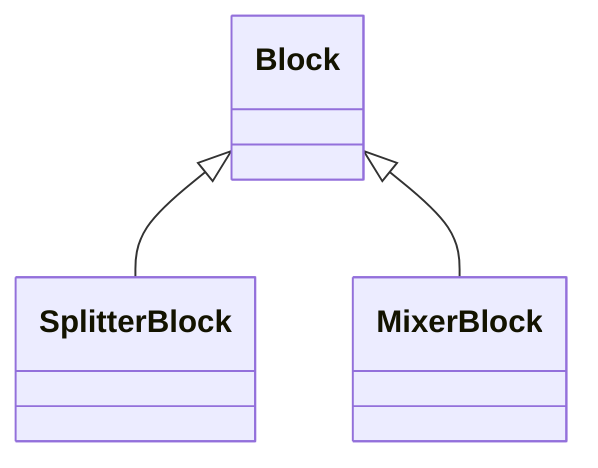
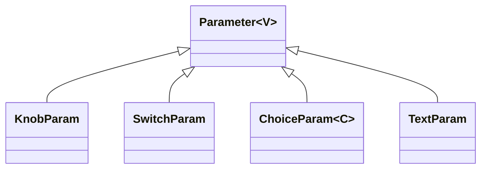

# The domain model

> **Status: the design; M1 is being built against it.** This document is the design for
> the object model of the Quad Cortex that pyquadcortex exposes: a Python API that looks
> and behaves like the unit itself. The namespaces below have landed; everything else here
> is still ahead of the code, and the code says what is built. Part I (this document's
> bulk) is the structural design -
> the object hierarchy, from the [Quad Cortex manual](https://neuraldsp.com/manual/quad-cortex).
> Part II (state tracking, the save lifecycle, and everything verified on hardware) was
> designed separately and is now merged in below, with its remaining gaps named in
> [§13](#13-still-open).
>
> The manual is the canonical reference for what the device does and how it presents
> itself. Where this design and the manual disagree, the manual wins; where the manual
> and the touchscreen disagree, the touchscreen wins.

## Design principles

1. **Screen-faithful, and the manual's own words.** Objects, properties, names, and units
   match what the unit shows. Rows are 1-4 and **slots** 1-8, which is the manual's word
   for the eight cells in a row ("four rows, each containing eight device block slots");
   scenes are letters; knobs read in dB/Hz/ms where the screen shows dB/Hz/ms. Where the
   manual has a word, the model uses it rather than the wire's - `slot` not `column`,
   *virtual device* not *model*, *item* not *entry*. A user who knows the unit recognizes
   the API without a mapping table.
2. **Strongly typed, deliberately polymorphic.** Every value has a real type: enums where
   the unit's option set is fixed, domain value types where it is structured, generics to
   carry value types through parameters. Capability differences are type differences - a
   factory preset *has no* `save()` rather than raising when you call it, and a row that
   cannot start a split *has no* `splitter`.
3. **Omission over caveat.** If a feature cannot be represented faithfully yet - the wire
   path is unknown, a display mapping is unverified - the model omits it and the appendix
   says why. It stays reachable through the protocol layer. No model API ships with a
   "this might be stale/wrong" caveat.
4. **Nothing audible is a side effect.** Recalling a preset and activating a scene change
   what comes out of the unit's outputs. In the model these are always explicit method
   calls (`item.recall()`, `scene.activate()`), never a consequence of reading a
   property.
5. **One translation boundary.** The model speaks touchscreen coordinates and display
   units everywhere. Conversion to protocol values (0-based indexes, raw scales) happens
   in exactly one module at the model-to-protocol seam. No `-1`/`+1` anywhere else.
   **Built:** the `pyquadcortex/device/translate/` package, with the rule enforced by a test that
   reads the source of the whole package outside `protocol/` - not just the model
   directory - rather than trusting a convention.

## Namespaces: the model becomes the front door

The model takes the top-level namespace. Today's protocol layer moves to
`pyquadcortex.protocol`, public and supported, with nothing about it changed but the
import path:

```python
import pyquadcortex

with pyquadcortex.connect() as device:          # the model: a Device
    ...

from pyquadcortex import protocol
qc = protocol.connect()                          # today's QuadCortex, unchanged
```

`Device.from_client(qc)` builds a model on an existing protocol connection, so the two
layers mix in one script. The rename lands with M1 (the first model release), so no
release ever has `connect()` meaning two different things. This amends ADR-0004's
"additive namespace" consequence and is recorded as ADR-0006.

**This part is built, and not yet released.** It landed in the M1 Epic (story OM-M1.1);
the version is cut once the model can read a preset, so that no published release ever has
`connect()` meaning two different things. `pyquadcortex/protocol/` is today's protocol
layer moved verbatim, and the `Device` the front door hands back is still a skeleton -
identity only - and fills in over the rest of M1.

---

# Part I - Structure

## 1. Device and the Directory



```python
class Device:
    # identity
    firmware: str                       # e.g. "d14e"
    serial: str

    # the preset on The Grid right now - never None on a connected device,
    # because the unit always has one loaded (see section 9)
    preset: Preset
    def recall(self, target: PresetItem | PresetAddress | str) -> Preset: ...  # "28C" works

    # the Directory
    setlists: Setlists                  # setlists["My Presets"], .factory, .my_presets
    favorites: Sequence[PresetItem | PluginPresetItem]
    recents: Sequence[PresetItem]
    captures: Library[CaptureItem]
    irs: Library[IRItem]
    plugin_presets: Library[PluginPresetItem]

    virtual_devices: VirtualDeviceList  # the VIRTUAL DEVICE LIST (section 5)

    # device-level features (section 6)
    io: IO                              # includes io.global_eq
    tuner: Tuner
    tempo: Tempo
    modes: Modes
    settings: Settings                  # Device Settings
    system: System                      # System Settings
    master_volume: MasterVolume
    gig_view: bool                      # open/close Gig View
    power_state: PowerOption            # read-only: awake vs standby (section 12)
```

`Setlists` covers every preset container the Directory shows: `Factory Presets` and
`My Presets` - both non-deletable, exposed as `.factory` and `.my_presets` - plus the
user setlists, which are created and deleted through the model (`setlists.create(name)`,
`setlist.delete()`, `setlist.rename(name)` - M3 lifecycle). The manual's limits (10 user
setlists, 256 presets each, 3072 total) are the device's to enforce; the model reports
the device's refusal rather than pre-checking.

> **`.my_presets`, not `.user`.** The manual uses "MY PRESETS" for one specific
> non-deletable setlist and "user setlist" for the ten a player creates, so `.user` read
> as "the user setlists" to anyone who had read chapter 5. Named for the screen instead.

```python
class Setlist:
    name: str
    def __getitem__(self, where: PresetAddress | str) -> PresetItem: ...  # setlist["28C"]
    def __iter__(self) -> Iterator[PresetItem]: ...
    def find(self, name: str) -> PresetItem | None: ...

class PresetAddress:
    """Where a preset lives, as the Directory shows it: a bank and a position in it."""
    bank: int
    position: str                       # "A".."H" under chapter 3's reading; see below
    # str() gives "28C"; parsing accepts the same form and rejects malformed input
```

> **The manual contradicts itself on bank size, by exactly a factor of two.** Chapter 3
> says banks of eight ("either A-D or E-H" in a PRESET-containing HYBRID mode, so eight
> otherwise); chapter 5 says four by default and two in HYBRID. The two accounts are each
> internally consistent, so this is not one stray sentence. `PresetAddress` models the
> *address* and takes no position on how many presets share a bank. Settled on hardware:
> chapter 3 is right at **8**, and a PRESET-containing HYBRID halves it to **4**, so
> `position` spans "A".."H" normally and "A".."D" there. The sting is that slot NAMES move
> with the mode - linear position 5 reads "1F" normally and "2B" under the hybrid - so an
> address is only unambiguous alongside the mode it was read in.

> **`PresetAddress` is built**, in `pyquadcortex/device/translate/` and exported from
> `pyquadcortex`. It speaks the non-hybrid naming, "A".."H". `PresetAddress.parse("28C")`
> refuses a malformed address there and then, rather than at write time, and `.to_wire()`
> / `.from_wire()` convert through the protocol layer's own `slot_to_position` pair so the
> two layers cannot drift on what "28C" means. The mode caveat above is on the converting
> function's docstring, where someone converting will read it. The Directory that hands
> addresses out is still ahead of the code.

### Directory items are a type family

Everything a Directory list can hold shares an `Item` base - the Directory's own word,
used throughout chapter 5 ("Items can be sorted, favorited, uploaded"). What you can *do*
to an item is expressed by its type. This is how read-only-ness works throughout the
model: factory content lacks mutating methods entirely, so misuse is a type error, not a
runtime surprise.



```python
class Item:
    name: str
    favorite: bool                      # settable - the manual favorites "items",
                                        # including Plugin Presets

class PresetItem(Item):                 # what the Directory's preset rows show
    address: PresetAddress
    setlist: Setlist
    instrument: Instrument              # Guitar / Bass / Synth / Vocal / Other
    def recall(self) -> Preset: ...     # audible - loads the preset on the unit

class UserPresetItem(PresetItem):
    def rename(self, name: str) -> None: ...
    def move_to(self, where: PresetAddress) -> None: ...   # same-setlist confirmed so far
    def copy_to(self, setlist: Setlist,
                where: PresetAddress | None = None) -> UserPresetItem: ...
    def delete(self) -> None: ...

class FactoryPresetItem(PresetItem):
    ...                                 # no mutating methods AT ALL

class CaptureItem(Item): ...            # place with row.place(slot, capture)
class IRItem(Item): ...                 # assign to an IR Loader slot
class PluginPresetItem(Item): ...       # listing and favoriting; see appendix
```

> **`instrument` is on the preset because the unit puts it there.** The manual mentions
> "Preferred Instrument" only for Neural Captures and as a Plugin Preset sort key, never
> on a preset - but all five values were confirmed by setting them on the unit's own
> picker and reading them back (`protocol.md`, "Tags are not preserved by ANY save path").
> The touchscreen wins over the manual by this document's own precedence rule, so the
> manual is simply behind here. Capture Type and Preferred Instrument ARE on the wire, as
> `ProductData.device` and `.instrument`, so `CaptureItem` can carry both - see
> [§13](#13-still-open) for the one Capture Type value the unit's filter does not name.

`Library[I]` is the read side of the Captures, IR and Plugin Preset libraries: iteration,
`find()`, and typed items. Library *management* (folders, rename, delete) has no known
wire path and is omitted for now - see the appendix. `recall()` returns a `UserPreset` or
`FactoryPreset` matching the entry's type, so the capability split carries through.

## 2. Preset and Scenes



```python
class Preset:
    name: str
    address: PresetAddress
    instrument: Instrument
    has_unsaved_changes: bool           # the italic name on screen (mechanics: section 11)
    is_current: bool                    # still the loaded preset? (section 12)

    scenes: Scenes                      # scenes["B"], scenes.active, iteration
    rows: Rows                          # rows[1] .. rows[4]
    blocks: BlockGrid                   # blocks[1, 3] - row, slot; ACTIVE scene
    stomps: Stomps                      # section 7
    midi_out: PresetMidiOut             # section 7

    def save_as(self, name: str, *, setlist: Setlist | None = None,
                instrument: Instrument | None = None,
                default_scene: SceneLetter | None = None) -> UserPresetItem: ...

class UserPreset(Preset):
    def save(self) -> None: ...         # persist in place

class FactoryPreset(Preset):
    ...                                 # editable live, but only save_as() persists

class Scene:
    letter: SceneLetter                 # "A".."H"
    name: str                           # editable, as in Gig View's EDIT SCENE
    blocks: BlockGrid                   # bound to THIS scene
    def activate(self) -> None: ...     # audible - explicit, like recall
```

> **Sections 2 and 3 are built**, less the parts that need the Directory or a write.
> `device.preset`, `preset.rows`, `row.slots`, `preset.blocks`, `scene.blocks`,
> `scenes.active`, `scene.name`, `scene.activate()`, splits, routing,
> `has_unsaved_changes` and `is_current` all read on hardware - with one gap
> stated rather than glossed: the loaded preset routes no row into another row,
> so the rule that such a row shows no LANE OUTPUT CONTROL is covered offline
> against a recorded payload that does, and the hardware test skips it aloud. Four things named above
> are deliberately NOT built, and each is an omission rather than a caveat (principle 3):
>
> * **`UserPreset` / `FactoryPreset`.** Which one you hold is a Directory fact, and the
>   only method that separates them - `save()` - is M2. A type split with nothing in it
>   would be shape without meaning, so `device.preset` is a `Preset` until the split
>   carries a method.
> * **`preset.instrument`** lives on the directory listing rather than in the preset, as
>   §11 says. It arrives with the Directory.
> * **`preset.address`** needs the Directory to say which setlist a position is in.
>   `SetlistPosition{READ}` is confirmed and the model tracks the loaded slot already;
>   what is missing is the setlist, not the read.
> * **Which row an output feeds.** `Output.NEXT_ROW_3` almost certainly means screen row
>   3 - the unit has four rows and the names fit - but almost certainly is a guess, and a
>   wrong row is the silent failure this whole design is arranged against. So
>   `output.destination` reads as the port it is, and `output.lane` is absent when that
>   port feeds a row, which is what the screen shows and is the part that can be checked.

**The scene/grid duality.** Blocks are placed once per preset; bypass state and
scene-following parameter values vary per scene. There is exactly one `Block` object
per occupied cell, and a `BlockGrid` is a *binding* of the grid to a scene context:

- `preset.blocks` is **live-bound**: it always reads and writes through whatever scene
  is currently active, like the touchscreen itself.
- `scene.blocks` is **fixed-bound** to that scene.

Scene-invariant facts (which device is placed, its position, its non-scene parameters)
are identical through every binding; scene-varying state differs. The two paths cannot
disagree because the object underneath is the same.

> **As built, "one object" means one CELL, not one Python object.** Two bindings hand
> back two handles on the same cell. They have to: a single object could not answer
> `bypassed` differently for `preset.blocks` and `sceneB.blocks`, which is the whole
> point of a binding. What the handles share is the payload underneath, so where a block
> is and which device is in it cannot differ between them. They compare EQUAL, and `is`
> is not the test - within one binding the same handle does come back.

Writing through a *non-active* scene's binding is **refused**, because the unit has no
way to do it without switching scenes first - which would change what you hear and leave
it changed. Reads through such a binding are fine. See
[§10](#writing-to-a-scene-you-are-not-in).

The default scene (the one a preset opens in) follows the unit's own rule: it is set by
saving while that scene is active, surfaced as the `default_scene` argument on the save
methods. Scene *copy* and *swap* (Gig View operations) have no audited wire path yet and
are omitted - see the appendix.

## 3. Rows and blocks



```python
class Row:
    number: int                          # 1..4, as on screen
    input: InputBlock
    output: OutputBlock
    slots: Slots                         # row.slots[3], 1..8 - the manual's word
    def place(self, slot: int,
              device: VirtualDevice | CaptureItem) -> DeviceBlock: ...

class SplittableRow(Row):
    """Rows 1 and 3 only: a branch can start here, with its parallel path below."""
    splitter: SplitterBlock | None        # at most one
    mixer: MixerBlock | None              # None = Path B goes to its own output
    path_b: Row                           # row 2 for row 1, row 4 for row 3
    def create_split(self, at: int) -> SplitterBlock: ...
    def rejoin(self, at: int) -> MixerBlock: ...      # adds the mixer
    def clear_split(self) -> None: ...                # removes both

class Rows:
    @overload
    def __getitem__(self, row: Literal[1, 3]) -> SplittableRow: ...
    @overload
    def __getitem__(self, row: Literal[2, 4]) -> Row: ...
```

**A split belongs to a pair of rows, and only the upper row can start one.** The manual
is explicit - "insert a Splitter or Mixer for the corresponding pair of Rows", and "Route
audio from Rows 1 or 3 (**Path A**) to Rows 2 or 4 (**Path B**)". So rows 1 and 3 are
`SplittableRow` and rows 2 and 4 are plain `Row`, which makes `rows[2].create_split()`
something your editor rejects rather than something that raises at runtime. Principle 2,
applied to the grid.

That also gives Path A and Path B a home: a `SplittableRow` *is* Path A, and its `path_b`
*is* Path B. No separate pair object is needed, and no row is reachable by two names.

> **The static catch needs a literal index.** `preset.rows[2]` is checked before you run
> it. A computed index resolves to `Row | SplittableRow`, so narrow it or accept a runtime
> error. Better than no check, and not absolute - stated rather than overclaimed.

**A split need not rejoin.** The manual allows Path B to reach "different output blocks"
*or* merge back, and the (S) and (M) tokens are placed independently. So `mixer` is
optional: `create_split()` alone leaves Path B with its own output, and `rejoin()` adds
the mixer later.

The block family mirrors what the grid can show:





```python
class Block:
    row: int
    slot: int                            # 1..8; input/output blocks sit outside 1-8

class DeviceBlock(Block):                # a placed virtual device
    device: VirtualDevice                # what the parameter editor calls
                                         # VIRTUAL DEVICE NAME
    bypassed: bool                       # per scene, via the binding
    params: Params                       # params["GAIN"] -> Parameter (section 4)
    stomp: StompAssignment | None        # section 7
    expression_bypass: ExpressionBypass | None
    def remove(self) -> None: ...
    def move_to(self, row: int, slot: int) -> None: ...   # cross-row = branch
    def replace(self, device: VirtualDevice) -> DeviceBlock: ...

class IRLoaderBlock(DeviceBlock):
    ir_slots: tuple[IRSlot, IRSlot]      # ir_slot.ir = an IRItem, by library key

class LooperBlock(DeviceBlock):
    state: LooperState                   # read-only: five states incl. OVERDUBBING
    # transport actions are NOT drivable over USB; MIDI CC#48-61 is the documented
    # route - see the appendix

class InputBlock(Block):
    source: InputSource                  # which physical input feeds this row
    gate: InputGate                      # NOISE REDUCTION / BYPASS / INPUT GAIN, per scene

class OutputBlock(Block):
    destination: OutputDestination       # physical out, send, USB, another row, Multi-Out
    lane: LaneOutput | None              # the manual's LANE OUTPUT CONTROL:
                                         # VOLUME/PAN/MUTE/SOLO, per scene. None when
                                         # routed to another row (as on screen)

class SplitterBlock(Block):
    params: Params        # TYPE, STEREO, BALANCE, LEVEL TO A/B, FREQUENCY, MODE, MUTE
    muted: bool           # the same control as the mixer's MUTE - see below

class MixerBlock(Block):
    params: Params        # LEVEL A/B, PAN A/B, PHASE, MIXER LEVEL, MUTE
    muted: bool           # the same control as the splitter's MUTE - see below
```

> **The splitter's MUTE and the mixer's MUTE are one control.** The manual lists a MUTE
> row under SPLITTER PARAMETERS and another under MIXER PARAMETERS, so it reads as two.
> On the unit they are linked: muting the splitter shows the mixer's MUTE already engaged,
> and it is not a catalogue parameter of either device (`protocol.md`, "Splitter and mixer
> MUTE is ONE control"). Both screen paths are kept, because both exist on screen, and
> `muted` on either object is the same state. Setting one changes the other.

Placement rules are the device's: a refused placement (DSP capacity) raises
`CapacityError` - *detected*, not predicted, because the wire offers no headroom read.
A cross-row `move_to` creates a branch, exactly as dragging does on the touchscreen.
Side-chain SOURCE/TRIGGER is an ordinary `ChoiceParam` on the blocks that have it.

### The collections, spelled out

Named here so every access path in this document leads to a declared type.

```python
class Setlists:                          # device.setlists
    factory: Setlist                     # Factory Presets
    my_presets: Setlist                  # My Presets
    def __getitem__(self, name: str) -> Setlist: ...
    def __iter__(self) -> Iterator[Setlist]: ...
    def create(self, name: str) -> Setlist: ...        # M3

class Library(Generic[I]):                # captures, IRs, plugin presets
    def __getitem__(self, name: str) -> I: ...
    def __iter__(self) -> Iterator[I]: ...
    def find(self, name: str) -> I | None: ...

class Scenes:                            # preset.scenes
    active: Scene
    def __getitem__(self, letter: str) -> Scene: ...   # scenes["B"]
    def __iter__(self) -> Iterator[Scene]: ...

class Slots:                             # row.slots - the eight cells in a row
    def __getitem__(self, slot: int) -> Block | None: ...   # 1..8
    def __iter__(self) -> Iterator[Block | None]: ...

class BlockGrid:                         # preset.blocks / scene.blocks
    def __getitem__(self, where: tuple[int, int]) -> Block | None: ...  # [row, slot]
    def __iter__(self) -> Iterator[DeviceBlock]: ...   # occupied cells only

class Params:                            # block.params
    def __getitem__(self, name: str) -> Parameter: ...  # params["GAIN"]
    def __iter__(self) -> Iterator[Parameter]: ...
```

## 4. Parameters



```python
class Parameter(Generic[V]):
    name: str                            # the label on screen
    value: V                             # typed get AND set
    follows_scenes: bool                 # settable: promote/demote (tap-and-hold on screen)
    expression: ExpressionAssignment | None      # section 7

class KnobParam(Parameter[float]):
    unit: str                            # "dB", "Hz", "ms", "%", ""
    range: Range                         # min/max as displayed

class SwitchParam(Parameter[bool]): ...  # two states only; see the note below

class TextParam(Parameter[str]): ...     # a free-text field, where one exists

class ChoiceParam(Parameter[C]):         # dropdowns, and switches of three or more
    options: Sequence[C]
```

> **Switches are not always boolean.** The manual describes SWITCHES as toggling "between
> **two or more** discrete states". `SwitchParam` covers the two-state case; a switch with
> three or more is a `ChoiceParam` over its own option list, even though the screen calls
> it a switch. `TextParam`'s only candidate so far - a cab's microphone - is described by
> the manual as *selectable*, not typed, so no confirmed `TextParam` exists yet; it stays
> in the design because the parameter-kind taxonomy needs it, not because a user can reach
> one today.

**Values are what the screen shows.** A knob that displays -6.0 dB reads and writes
`-6.0`. The raw wire scale (0..1 with unity at 0.769, and friends) is the translation
boundary's problem. A parameter whose display mapping is *unverified* is omitted from
the model until verified, per principle 3.

**Choice types.** Where the unit's option set is fixed, `C` is a real enum
(`ChoiceParam[TimeSignature]`, `ChoiceParam[FilterType]`). Where the option list is
dynamic but *structured* - routing sources whose membership grows with the preset
("Follow Input", "Input 1", "Return 2", "USB Input 5"...) - `C` is a domain value type
(`Source`) parsed from the device's own option list, dynamic in membership but fixed in
type. Only genuinely free-form lists fall back to `str`. Option names always come from
the preset's own `dynamic_steps`, so they match the screen exactly.

## 5. The Virtual Device List

```python
class VirtualDeviceList:                 # the VIRTUAL DEVICE LIST, as on screen
    categories: Sequence[Category]       # AMP, CAB, DELAY ...
    def find(self, name: str) -> VirtualDevice | None: ...
    pinned: Sequence[VirtualDevice]
    def pin(self, device: VirtualDevice) / unpin(...): ...

class VirtualDevice:
    name: str                            # the parameter editor's VIRTUAL DEVICE NAME
    category: Category
    stereo: bool
    sidechain: bool                      # the (S/C) marker
```

The list is the device's own model repository, so it reflects purchased and captured
content. Plugin-locked devices appear with their plugin marker, matching the list on
screen.

> **Named for the screen, not the wire.** The protocol calls this the model repository and
> its entries models, and the model layer used to as well. But *model* is also this
> document's word for the domain model, and the unit's own words are VIRTUAL DEVICE LIST
> and VIRTUAL DEVICE NAME. The screen wins.

## 6. Device-level features

Each feature object mirrors one screen or menu on the unit.

```python
class IO:                                # the I/O Settings menu (swipe down)
    inputs: Mapping[str, InputPort]      # "INPUT 1", "INPUT 2"
    returns: Mapping[str, ReturnPort]
    outputs: Mapping[str, OutputPort]    # "OUT 1/L" .. "OUT 4/R", sends
    output_pairs: Mapping[str, OutputPair]   # OUTPUT PAIRING, per pair
    expression: Mapping[str, ExpressionPort] # "EXP 1", "EXP 2" - tappable here
    usb: USBPorts
    global_eq: GlobalEQ                  # tapped at the TOP of I/O Settings

class InputPort:
    level_db: float
    impedance: Impedance                 # enum; disabled in Mic type, as on screen
    input_type: InputType | None         # Instrument / Mic. None on ESS-codec units,
                                         # which show no TYPE switch at all
    # PHANTOM 48V: omitted - no field exists in the schema (appendix)

class OutputPort:
    level_db: float
    ground_lift: bool
    muted: bool
class OutputPair:
    linked: bool                         # OUTPUT PAIRING; paired outs share values

class ExpressionPort:
    position: float                      # read-only: the POSITION indicator
    # RECALIBRATE: omitted - no known wire path (appendix)

class USBPorts:
    level: float
    hp_source: HPSource                  # enum
    dry_wet: DryWet                      # enum: DI vs processed on outs 1/2, 3/4
    midi_thru: bool                      # listed on this screen AND under Device MIDI

class GlobalEQ:                          # a sub-screen of I/O Settings, per the manual
    bypassed: bool
    bands: Sequence[EQBand]              # 5 bands
    outputs: EQOutputAssignment          # out 1/2, out 3/4
    auto_disabled: bool                  # read-only: the unit sheds it under DSP pressure
class EQBand:
    filter_type: FilterType
    gain_db: float                       # -12..+12
    frequency_hz: float                  # 20..20k
    q: float
    bypassed: bool                       # the screen says EQ BAND BYPASS
    # the OUT tab's overall LEVEL: omitted - dB mapping unverified (appendix)

class Tuner:
    visible: bool                        # show/hide the Tuner menu
    reference_hz: float                  # displayed absolute Hz (wire stores the offset)
    source: TunerSource                  # inputs, returns, INPUT_1_2, USB 5/6
    muted: bool
    # LIVE TUNER (the streaming needle): omitted by decision (appendix)

class Tempo:                             # the Tempo & Metronome menu
    bpm: float                           # the tempo IN EFFECT - see the note below
    mode: TempoMode                      # GLOBAL or PRESET, as the menu shows it.
                                         # Readable and writable: the wire path is
                                         # the device tempo block's parameter 1
                                         # (found 2026-08-12). See section 13
    led: bool
    metronome: Metronome
class Metronome:
    muted: bool                          # MUTE on the unit, PLAYBACK in the manual:
                                         # one control. It mutes; it does not stop the
                                         # clock (section 9)
    volume: float
    pan: float
    time_signature: TimeSignature
    subdivision: Subdivision
    sound: MetronomeSound
    routing: MetronomeRouting

class Modes:
    active: ModeSlot                     # what the top-right corner shows
    cycle: Sequence[ModeSlot]            # reorder / merge / remove via set_cycle
    def set_active(self, slot: ModeSlot) -> None: ...
    def set_cycle(self, slots: Sequence[ModeSlot]) -> None: ...
# ModeSlot = Mode | HybridMode; Mode is PRESET/SCENE/STOMP,
# HybridMode(top=..., bottom=...) models all six ordered pairings.
# A cycle holds at most one hybrid and a hybrid cannot be the only slot -
# the device's own rules, enforced by the device; the model surfaces its refusal.

class MasterVolume:
    level: float                         # READ-ONLY: a MasterVolume write is ignored,
                                         # measured. See section 13 - Cortex Control does
                                         # move it, by a route we have not found
    outputs: set[OutputAssignment]       # the overlay's checkboxes

class Settings:                          # the DEVICE SETTINGS section of chapter 10
    global_bypass: GlobalBypass          # Cab / IR Loader, four rows each
    scene_bypass_behavior: SceneBypassBehavior   # enum, three modes
    stomp_mode_bypass: bool              # the screen's own label
    hold_timing_ms: int                  # 500-1000 in 100 ms steps, as on screen
    swap_tempo_and_tuner: bool
    gig_view_access: bool
    latency_compensation: bool
    midi: MidiSettings                   # channel, thru, over USB, ignore dup PC, clock in/out

class System:                            # the SYSTEM SETTINGS section of chapter 10
    brightness: Brightness               # screen and LED brightness
    storage: Storage                     # read-only: presets/captures/IRs disk usage
    master_volume_knob: MasterVolumeKnob # enum: global vs output-specific
```

> **`Tempo.mode` is an ordinary readable, writable property.** It was modelled and
> refused for one release under ADR-0007, on the strength of three tests that watched
> for a broadcast when the switch moves and saw nothing. The switch does not broadcast -
> that holds - but it answers a READ, and it takes a write. The wire path is the DEVICE
> tempo block's parameter 1, carried in `GlobalTempo.params`: `0.0` is PRESET, `1.0` is
> GLOBAL. Found 2026-08-12 and confirmed three ways - the wire value moved and moved
> back, the unit's own menu followed a host write, and the tempo in effect switched
> between the two blocks' stored values. `protocol.md`, "MODE is the DEVICE tempo block's
> parameter 1", has the method and the evidence.
>
> **`mode` is a DEVICE setting, not a preset one**, even though it rides a tempo
> message. Writing it affects every preset and there is nothing to save afterwards. It
> belongs to the M3 device-settings surface with the rest of `Tempo`; nothing here ships
> at M1.
>
> The unit keeps BOTH tempo blocks at all times and `mode` selects which one plays -
> writing it moves neither. So `bpm` is the tempo in effect, which is the preset's own
> tempo in PRESET mode and the device's in GLOBAL mode. The unit resolves that, not the
> model.

> **Two sections, not one.** Chapter 10 has four named subsections - Account, System,
> Device, Support. Brightness, device storage and the master-volume knob function live
> under **System**, the other eight rows under **Device**, so `settings` and `system` are
> separate objects rather than one flattened bag. Account and Support are omitted: cloud
> surfaces are out of scope, and Support is diagnostics.

## 7. Assignments and Preset MIDI Out

```python
class StompAssignment:                   # footswitches A-H in Stomp mode, per preset
    footswitch: FootswitchLetter         # "A".."H"
    targets: Sequence[DeviceBlock]       # one switch can toggle several blocks
    label: str                           # EDIT STOMP's custom name
    momentary: bool                      # RESTORED: the unit's Assign footswitch modal
    #   has a Latching/Momentary toggle that the manual never mentions. Settable ONLY
    #   when len(targets) == 1 - the device silently refuses a multi-block switch and
    #   greys its own toggle out in the same case, so the model refuses it honestly
    #   rather than passing a write through that will not land.

class Stomps:                            # preset.stomps
    def __getitem__(self, footswitch: str) -> StompAssignment | None: ...
    def assign(self, footswitch: str, block: DeviceBlock,
               label: str | None = None) -> StompAssignment: ...
    def clear(self, footswitch: str) -> None: ...
```

> **The footswitch letter is a type, not a convention.** `stomp_is_momentary` is keyed by
> footswitch index, and that stayed hidden for months because every sample happened to
> have the footswitch index equal to the block's column - an assumption that looked like a
> fact until a block at column 3 was assigned to footswitch E and the key came back 4.
> Documenting the difference is not enough. `FootswitchLetter` is the model's only public
> key for a footswitch, and the zero-based index stays inside the protocol layer where the
> `Footswitch` enum already lives. Where a bare `int` can reach a model API, someone
> eventually passes a column to it and gets a write that silently does nothing, which is
> precisely the bug that cost a hardware session to find.
>
> **`FootswitchLetter` is built**, in `pyquadcortex/device/translate/` and exported from
> `pyquadcortex`. It is a `StrEnum`, so `stomps["E"]` and `stomps[FootswitchLetter.E]` are
> the same key and it prints as the screen labels it. Passing the number 4 raises, with a
> message naming the column trap. `SceneLetter` is the same type for scenes.
>
> **A device-level footswitch object is deferred, deliberately.** There are now two
> footswitch-keyed collections at different scopes - `preset.stomps` per preset and
> `settings.looper_actions` global - plus the mode that decides which is live, so nothing
> answers "what does switch E do right now". A `device.footswitches[...]` would have to
> reach across the Device/Preset boundary this model otherwise keeps clean, and at M1
> nothing needs it. Revisit at M2, when editing makes that question common.

```python
class ExpressionAssignment:              # assigned FROM the parameter, as on screen
    pedal: ExpressionPedal               # EXP 1 / EXP 2
    minimum: float                       # MIN RANGE, in the parameter's own units
    maximum: float                       # MAX RANGE; min>max reverses, as documented

class ExpressionBypass:
    mode: ExpressionSwitchMode           # HEEL_TOE / SWITCH / STOP
    invert: bool                         # INVERT RANGE
    switch_delay_ms: int                 # SWITCH DELAY, real ms; greyed out in SWITCH mode
    latch_emulation: bool                # LATCH EMULATION; greyed out in HEEL_TOE mode
    # All three verified on hardware as ExpressionBypassInfo{invert, delay_ms,
    # latch_emulation}; a false always travels as an absent field.
    # The mode decides which of the last two exist, and they are mutually
    # exclusive in the two modes measured: SWITCH offers latch and no delay,
    # HEEL_TOE offers delay and no latch. STOP's delay is confirmed; whether it
    # offers latch emulation has never been looked at.
    # This same message carries a LANE OUTPUT's MUTE and SOLO settings:
    # output_control pre-allocates two slots, MUTE at [0] and SOLO at [1], both
    # confirmed by moving them one at a time on the unit. input_control carries
    # one, an ordinary block none until set_expression_bypass adds it.
    # NOT "one slot per switch parameter" - that rule was tried and is false.
    # The Jewel's HIGH CUT, the Mixer's PHASE and the Splitter's TYPE are all
    # switch-typed and their blocks carry no slot at all. What generates the
    # pre-allocation is unestablished; only the counts and the MUTE/SOLO
    # positions are measured.

class PresetMidiOut:                     # preset.midi_out - the Preset MIDI Out menu
    on_load: Sequence[OnLoadMessage]
    footswitches: Mapping[FootswitchLetter, Sequence[FootswitchMessage]]
    expression: Mapping[ExpressionPedal, Sequence[FootswitchMessage]]
# FootswitchMessage = ControlChange | ControlChangeToggle | ProgramChange
# OnLoadMessage     = ControlChange | ProgramChange
```

> **On-load messages cannot be CC Toggle.** The manual gives footswitch and expression
> messages three types (CC, CC Toggle, PC) and on-load messages only two (CC or PC), and
> reinforces it - MIN/MAX VALUE, the CC-Toggle-only field, appears only in the footswitch
> block. Two unions rather than one, so the narrower screen is the narrower type. Principle
> 2 again.

Expression-assigned parameters are excluded from scene data (the unit's rule); the model
reflects that: assigning an expression pedal to a parameter fixes `follows_scenes` off,
matching the screen's behavior.

## 8. Errors

- `CapacityError` - the device refused a placement or move (DSP headroom). Detected, not
  predicted.
- `DeviceLostError` - the device went away. Detection and cache consequences are in
  [§12](#12-disconnect-standby-and-reconnect); the protocol layer raises this type, so
  the model does not invent its own.
- Static prevention beats runtime errors everywhere types can carry the rule: factory
  types lack mutating methods, enums bound choice values, `PresetAddress` rejects malformed
  addresses at parse time.

The device accepts-and-ignores writes it does not understand, so the model's contract
is: **every mutating call either verifies acceptance or is backed by a
hardware-confirmed protocol method**. The mechanics - echoes, the three-way watcher, and
the one write that blocks - are in [§10](#10-writing-and-knowing-a-write-landed).

---

# Part II - Behavior

How the model tracks what the unit is doing, and how saving works. Every number here
was measured on hardware (firmware `d14e`, CorOS 4.0.1) rather than read off the schema.
Where something was not established, it says so - see
[§13, still open](#13-still-open).

## 9. How the model keeps its facts current

The model remembers what it learned from the unit, so reading a value is fast. The risk
is obvious: someone touches the unit, and what we remember goes wrong. Three rules
handle it.

**1. The unit tells us when things change.** Turn a knob on the touchscreen and the unit
sends a message saying what changed. We store the new value, so reading it later costs
nothing. Confirmed: one on-unit edit produced 40 `Grid` pushes.

**2. If a message mentions something we do not model, we stop trusting our copy.**
Suppose someone edits a splitter. The model cannot represent a splitter at all (no host
write path, and the wire carries no position for it - see the appendix), so the push names something we have
no code for. Then we discard our copy of that preset and read a fresh one. Slower, but
right. A message of a type we know nothing about is ignored outright, which is what the
RX thread already does.

The check is per FIELD, not per message type. Applying the half of a message we
understand and silently dropping the rest is the one failure mode that leaves the cache
confidently wrong, so it is the case this rule exists to catch.

**Two message types are handled by type rather than by field, because the per-field
check cannot see them.** `Grid` carries its meaning in `action`, which the wire gives no
presence, so an `UPDATE` and a `DELETE` with the same payload look identical to a
field-by-field reading. `SceneLabel` gives `index` and `label` no presence either, so
renaming scene A to a blank label sets *nothing at all* that a field check can observe.
Both are therefore declared as voiding the copy outright: every message of those types
means the preset moved, whatever it appears to carry. That is each entry's own decision
about `action`, made per entry and per type; the shared scaffolding skip is not widened.

**A grid push is not merged.** A `Grid` echo is a sparse, keyed delta into a deeply
nested structure. Rather than apply it, the model notes that the grid moved and re-reads
the whole live preset on the next access. One edit on the touchscreen produces about
forty of these and costs exactly one re-read, because the note is a flag rather than a
queue, and `RecallPreset{READ}` has no side effects.

What merging would take, if it is ever worth doing: each push applied BY KEY into the
stored payload - chain by row, model by column, parameter by index - and, to stay honest,
the "did this mention something we do not model" check walking that structure recursively
instead of reading the top level. The prize is that reads stay instant while somebody is
editing on the unit. The reason it is not M1 is that the recursive check is where all of
its risk sits, and it would have sat next to the objects three other stories are blocked
on. A caller who needs the fresh value sooner subscribes to `device.events` - below - and
reads it themselves.

**A push carrying every field an entry keeps clears the mark.** It is the same thing a
read returns, so it replaces rather than merges, and an entry holding the unit's own
complete answer has nothing left to ask about. This is what makes the connect burst leave
the cache genuinely warm rather than nominally warm: measured 2026-08-15, the burst
delivers `RecallPreset`, `SetlistPosition`, `PresetDirty` and `Scene` in that order
inside ten milliseconds, so two entries are marked by one message and answered in full by
the next.

**3. When we write, we update our copy immediately.** The unit echoes our own change
back, and that echo confirms it. Because we already applied it, a matching echo changes
nothing - one code path, not two. Waiting for the echo before updating would make every
write pay for information we almost always already have.

This is a deliberate trade. If a write is wrong, the echo disagrees with our copy and we
have written a bug - so the place to catch it is a hardware test that performs every
supported write and asserts the read-back, which is what ADR-0005's suite is for, not a
check on every call at runtime. [§10](#10-writing-and-knowing-a-write-landed) covers what
happens when an echo does disagree.

### What we track, and how each part stays current

| What | Where you read it | How we ask | What tells us it changed |
|---|---|---|---|
| The preset on the grid now | `device.preset` (**built**) | `RecallPreset{READ}` | `Grid`, `RecallPreset` |
| Which scene is active | `preset.scenes.active` (**built**) | `Scene{READ}` | `Scene` |
| Scene names and colors | `scene.name` | comes with the preset | `SceneLabel`, `SceneColor` |
| Unsaved edits | `preset.has_unsaved_changes` (**built**) | `PresetDirty{READ}` | `PresetDirty`, and a recall - which pushes NOTHING, so it is re-read |
| Which preset is loaded | `preset.is_current` (**built**); `preset.address` needs the Directory | `SetlistPosition{READ}` - confirmed 2026-08-15, 3 ms | `SetlistPosition` |
| What is in a setlist | `setlist` iteration | `File{READ}` | `File` |
| Recents and favorites | `device.recents`, `.favorites` | `RecentsFavorites{READ}` | `RecentsFavorites` |
| I/O, settings, EQ, volume, mode | `device.io` and friends | one READ each | one push each |
| Power state (awake / standby) | `device.power_state` | in general settings | `GeneralSettings` |
| Device list, firmware, serial | `device.virtual_devices`, `.firmware` | `ModelRepo`, `Version` | nothing; these do not change |

The third column is the safety net. Wherever the fourth turns out to be unreliable, we
ask instead of remembering, which is what lets the model honour principle 3 and never
hand back a value with a "might be stale" caveat.

### Telling a caller what we noticed

Re-reading only happens when somebody asks for a value, which is too late for a script
following the unit closely. So the model publishes what it noticed, and a subscriber can
fetch the fresh value itself:

```python
with pyquadcortex.connect() as device:
    device.events.subscribe(print)
```

Two events, both about the model's copy rather than about the wire. `Changed(part,
fields)` when a push moved a value we hold, and `Invalidated(part, why)` when we stopped
trusting our copy of something. Two rules keep the stream usable: `Invalidated` fires on
the change from trusted to untrusted, so one edit on the touchscreen produces one event
rather than forty, and `Changed` fires only when a value really moved, so the unit
restating what it has already said is silent.

**A subscriber runs on a thread the model owns, and may read from the unit.** That is the
whole reason the thread exists. Messages arrive on the RX thread, which may not read
([§9](#9-how-the-model-keeps-its-facts-current) rule 5, ADR-0009), so handing an event
over there would make the obvious reaction - go and re-read it - raise. The RX thread
queues; the model's thread delivers. The costs are ordinary and worth stating: an event
can lag by however long the subscribers ahead of it take, they are served one at a time
in subscription order, and a subscriber that blocks forever holds up the ones behind it.
None of that can delay the unit.

### Smaller decisions

1. **Connecting already warms almost everything, so there is little to fetch.** The
   handshake's subscription burst delivers one message of nearly every state type. Its
   measured shape: about 3 s of quiet, then the model repository as one huge message,
   then ~400 `File` messages at ~1490 reports/s for 5 s, then everything else at once -
   including the current preset - about 9 s in. So the cache is warm for free, and the
   read paths are the fallback rather than the normal route. Anything not yet delivered
   is fetched on first access.
2. **Pushes are often partial.** A push after an update may carry one field with
   everything else absent - the standby announcement carries only `power_option`. An
   absent field means "not mentioned", never "changed to default", so pushes merge into
   our copy rather than replacing it.
3. **Recalling a preset resets three things at once**: the grid contents, the active
   scene, and the unsaved-changes flag. The unit moves them together, so we do too.
4. **Deleting or moving a preset needs a retry.** The unit does the work immediately but
   its preset listing lags a couple of seconds. So we re-read until the listing reflects
   the change rather than storing the first, stale answer.
5. **The RX thread never asks the unit for anything.** It applies pushes and notes what
   needs re-reading; the caller's thread does any re-reading. This preserves the rule
   that the RX thread can never block or die.
6. **Reconnecting discards everything**, firmware and serial included - see
   [§12](#12-disconnect-standby-and-reconnect).
7. **The tempo stream is not a change signal.** The metronome clock always runs, so
   `GlobalTempo` arrives in pairs, one pair per beat (measured 1.5 s apart at 40 bpm), on
   every connection. Treating every inbound message as "something changed, go re-read"
   would have had the model re-reading constantly for no reason. Applying pushes as data
   does not care.

   The control that looks like a start/stop is not one. It is **one control with three
   names** - MUTE on the unit, START in the catalogue, PLAYBACK in the manual - traced to
   tempo parameter 4 by pressing the unit's own MUTE button. It silences the metronome
   rather than stopping the clock, which is why the stream never pauses. The model calls it
   `metronome.muted`, after the label a player actually sees.

## 10. Writing, and knowing a write landed

The unit accepts writes it does not understand and silently does nothing, so "no error"
proves nothing. What we have instead is the echo.

**The echo is a sparse, keyed delta.** Writing one parameter produced a `Grid` push of
**23 bytes**: one chain with `row` set, one entry with `column` set (the wire's word for
what the screen calls a slot), one parameter, and nothing else. That is worth stating plainly because it is the opposite of a recalled
preset, whose chains carry *no* explicit row - the reason writing a whole preset back
does nothing. Echoes are unambiguous where recalls are positional, so an echo merges
into our copy with no guessing.

Measured echo latency: **113-116 ms** for a parameter write, **290-420 ms** for a block
placement. These two set the watcher's window. The other write types read far quicker
(scene label, scene colour and global settings about 2 ms, routing 9-19 ms), but those
figures carry a caveat that belongs with them rather than here - see
[`protocol.md`](protocol.md); block bypass is still unmeasured entirely.

**Each write gets a watcher** that compares the echo against what we sent and reports one
of three outcomes:

- **Confirmed** - every field we sent came back with the value we sent. Our copy was
  already right; nothing to do.
- **Different** - a field we sent came back with another value. Log the field, what we
  sent, and what came back. That is a bug in our code, now with a name and a location.
- **Timed out** - nothing came back. Log it and mark that part of our copy for
  re-reading, so the next read gets the truth from the unit. A silently ignored write
  self-corrects instead of poisoning the cache.

The watcher does not block the write, and the bar is exactly one sentence:

> Every field we sent must come back with the value we sent.

Not "the echo equals what we sent" - that would cry wolf constantly, because the unit
legitimately changes things we did not ask about. All four known cases are things we did
not send, so none of them needs an exception:

| The unit also changes | Why |
|---|---|
| GAIN REDUCTION (`input_control` index 2) | a live meter, sampled into the preset at save time |
| A mirrored parameter | writing the metronome transport also moves a Looper X parameter |
| NaN in unused parameter slots | factory presets store it; NaN never equals itself |
| Dropdown values on untouched rows | adding a block changes the option count, so stored values are recomputed |

Applying the whole echo to our copy handles all four for free: the mirrored parameter and
the recomputed dropdowns land in our copy without the model knowing they exist.

**Placement is the one write that waits.** Whether a block fits depends on how much DSP
the preset already uses, and DSP load is unreadable on this firmware (`CPULoad` never
arrives), so there is no test we can pre-run - the answer depends on the user's preset.
The unit echoes every cell it accepts and gives a refused block no echo at all, so
`row.place()` waits for that echo and raises `CapacityError` when it does not come. It
returns in about a third of a second normally; only a real refusal waits out the timeout.

Everything else - parameters, bypass, routing, scene names, I/O, settings - updates our
copy immediately and is confirmed in the background.

### Writing to a scene you are not in

The unit has no way to write to a scene that is not active - you switch to it first. So
`scene.blocks[1, 3].bypassed = False` on an inactive scene would have to activate that
scene, which changes what comes out of the outputs and *leaves it changed*. The effect
would be far larger than the request.

**So a `BlockGrid` bound to an inactive scene refuses writes**, and the error names
`scene.activate()` as the step to take. Reads through it are fine. This is the unit's own
limitation, mirrored rather than papered over, and it costs the caller one line. It
settles the question Part I's [§2](#2-preset-and-scenes) left open.

## 11. The save lifecycle

**How the unit works.** There is no separate edit buffer. You edit the grid directly, and
what is on the grid is what you hear. Saving snapshots the grid into a slot: the save
message carries no preset data at all, just a slot and a name. That is why the protocol
edit path is recall, then small keyed edits, then save. The model hides all three - you
get a preset, change it, and call `save()`.

**Two ways to save.**

- `save()` writes back to the same slot under the same name. Confirmed safe: re-saving
  the same name to the same slot is *not* treated as a collision, so the unit does not
  append a `_2` suffix.
- `save_as(name)` writes to a new slot or name, and that *can* collide - the unit renames
  rather than refusing. So the returned `UserPresetItem` is the authority on what was
  actually stored: read `entry.name`, not the name you passed in.

**Factory presets.** You can edit a factory preset on the grid and hear the change; you
just cannot save it in place. Part I already handles this by type - `FactoryPreset` has
no `save()` at all, so it is a mistake your editor catches rather than a runtime error.
`save_as()` on a factory preset targets a user setlist, defaulting to My Presets.

**Losing edits.** Recalling another preset discards unsaved changes and resets the active
scene. **The model does the same, silently, because that is what the unit does.** What
makes this safe rather than careless is principle 4: recalling is always an explicit
call, never a consequence of reading a property. The only way to lose work is to ask for
it, and `preset.has_unsaved_changes` is there to check first.

**`has_unsaved_changes` is cheap and always available.** `preset_dirty()` answers in
**2-11 ms** across every measured poll, reads true after an edit and false after a clean
save, and the unit also pushes it unsolicited in the connect burst and on every edit. So
the model subscribes rather than polls, and the value is warm from the moment we connect.
One protocol detail the model absorbs: `is_dirty` has no field presence, so absent simply
*is* false.

**Two warts the model hides.**

Place a Neural Capture, bypass it, save - and the bypass is gone. It survives on the live
grid; it just does not survive that first save, while an ordinary block in the same row is
fine. The sequence that works is save, recall the slot, set the bypass again, save again
(field-verified on 24 presets). `save()` performs that sequence itself when the preset has
a freshly placed capture with a non-default bypass. It costs a few seconds, and because
the recall in the middle resets the active scene, the model restores the active scene
afterwards.

A preset's default scene is whichever scene was active when it was saved. So
`save(default_scene="C")` activates scene C, saves, and returns to the scene you were on.
That is audible twice, which is worth doing rather than refusing, but you will hear it.

**What no save can keep.** Descriptive tags are lost by every save path including the
unit's own, so a preset derived from a factory preset is simply untagged. Not a library
limitation and nothing to work around. The instrument category is separate and does
survive, because it lives on the directory listing rather than in the preset.

## 12. Disconnect, standby, and reconnect

**The unit going away is free to detect.** A read raising means the device is gone; a
write raising means nothing at all. Over one measured 145-second healthy session there
were **0 read exceptions and 91 write exceptions**, because every write to a healthy unit
"fails" via the status-stage stall. Detection lands within the 200 ms read window.

Nothing may branch on the exception text. It is often the stale write-stall lookalike
rather than anything honest: across four measured loss transitions, one reboot gave the
misleading text on both read attempts, another gave the honest text on both, and a
shutdown gave one of each. The reliable signal is that a read raised at all. The protocol
layer surfaces this as `DeviceLostError`, and **Part I's section 8 should be read as
naming that type** - `NotConnectedError` was a placeholder from before the protocol layer
shipped it.

**Asleep is not the same as gone.** The power button's three options behave completely
differently, and the model must not confuse them:

| Action | What happens on the wire |
|---|---|
| Be Right Back (standby) | **No disconnect at all.** The session stays fully alive - probes kept answering in 2 ms. Announced by a partial settings push carrying only `power_option: 2`, then `3` on waking. Connecting fresh while asleep works normally. |
| Reboot | Session dies with no announcement. Healthy 3 ms probes, then the read raises. |
| Shutdown | Same - no announcement, no goodbye. |

So a script can be talking to a sleeping unit over a perfectly healthy connection. The
model exposes `device.power_state` so that is visible rather than surprising. Reading the
field is all the model does with it: writing `power_option` would let a script shut the
unit down, and the protocol layer refuses the write.

**Lock mode does not block us.** With the unit's screen and volume knob locked, a
parameter write landed and read back exactly. Lock mode locks the touchscreen only. Worth
saying because "locked" invites the opposite assumption.

**Reconnect is transparent, and logged.** When the model notices the unit has gone:

1. The RX thread records the loss, logs a warning, and stops - so the warning appears
   immediately even in a script that is only listening.
2. Everything we remembered is discarded, firmware and serial included.
3. The next call from the caller's thread reconnects: find the unit, open it, run the
   handshake. Recovery happens on the caller's thread, so there is no hidden background
   activity.
4. If that call was a **read**, it runs again and returns normally, a few seconds later.
5. If it was a **write**, it raises. We never replay it - a unit that came back may have
   been power-cycled with a different preset on the grid, and a replayed parameter write
   would land somewhere the caller never asked for.

**Opening the device proves nothing about readiness.** There is a real window where the
unit is enumerated and openable but the control protocol does not answer: measured at ~9 s
after a reboot and 11.7 s after a cold boot, and the protocol layer's `handshake_patience`
default was subsequently raised to **30 s** after 15 s was measured failing live. So the
handshake itself is retried, not just the open. Unattended recovery from a reboot took
about 55 seconds end to end.

**A held preset can go stale, so it checks itself.** If you hold a `Preset` and the loaded
slot changes, that object now points at something else, and writing through it would edit
a preset you never opened. Every mutating call therefore checks first - locally, against
the loaded slot we already track, with no device round trip - and raises rather than
editing the wrong preset. `preset.is_current` exposes the same check for callers who want
to ask.

This is deliberately not reconnect-specific. Someone tapping a different slot on the
touchscreen invalidates a held preset just as thoroughly, and far more often. One rule
covers both. It is also the one place the model has a concept the unit lacks - but so is
holding a preset object at all, so it earns its place. `device.preset` always returns the
current one.

## 13. Still open

Named so nothing here is mistaken for verified. Everything this list used to hold was
closed on hardware on 2026-08-07; what survives is below, and each entry says what was
tried rather than just what is unknown.

### Genuinely open

- **`RecallPreset.reason` UNDO.** The value exists in the schema and has never been
  observed. It may be unreachable on this firmware: there is **no grid-level undo on the
  unit** - the only UNDO is Looper X's, which is a Looper action and not a preset recall -
  so nothing found so far can cause a recall whose reason is UNDO. `UndoRedo` messages do
  arrive after accepted edits and carry a per-slot frame count, so the undo machinery is
  real; what is missing is any way for a human or a host to trigger it.
- **Bypass persistence over MIDI.** The unit's own SCENE BYPASS BEHAVIOR wording groups
  **MIDI with footswitches**, not with the touchscreen - a distinction the manual's summary
  omits. A USB HID write was measured and behaves like the touchscreen, but the MIDI half
  is untested because this library has no MIDI path. Do not assume a future MIDI route
  inherits the host write's behaviour.
- **The first-generation I/O variant.** `Version.is_ess` IS the discriminator the model
  needed, and reads `True` here. But only an ESS unit has ever been available, so the
  first-generation value is inferred from the field's name rather than observed, and the
  correlation with `InputPort.input_type` presence rests on one machine.
- **Capture Type value 8.** `ProductData.device` is the manual's Capture Type, keyed
  zero-based against the unit's own filter list: Default, Amp, Combo Amp, Amp + Cab, Cab,
  Overdrive, Fuzz, Compressor. A ninth value, `8`, is in use by 102 factory V2 captures -
  all of them drive and distortion pedals - and the filter offers no category for it. Those
  captures list normally with no filter applied, so enumeration by folder is safe and
  enumeration by filter would silently drop them. The name of value 8 is unknown.

### Closed, with where the answer lives

| was open | outcome |
|---|---|
| Device-wide broadcast sweep | swept; all eight action categories captured |
| Echo latencies for the unmeasured write types | `tests/hardware/test_write_echo.py`; the two previously measured types are the two slowest |
| Writes during standby | honoured, and they survive the wake |
| Bank size, 8 versus 4 | 8, and 4 under a PRESET hybrid - and slot NAMES are mode-dependent, so `slot_to_position` speaks the non-hybrid naming |
| Scene name and colour writes | `SceneLabel` / `SceneColor`. An edit made on the unit re-broadcasts all eight. A host write was observed echoing only the index it wrote, as two identical messages - one capture of one label write, so treat the count as indicative and the "only the written index" half as the load-bearing part |
| Scene copy and swap | `SceneCopy{from_index, to_index, is_swap}` |
| The three ExpressionBypass fields | `invert`, `delay_ms` in real milliseconds, `latch_emulation` |
| `SCENE BYPASS BEHAVIOR` persistence | a host write counts as a touchscreen edit; see `protocol.md` |
| `FileMessage.type` | 0 presets, 1 IRs, 2 captures |
| `stomp.momentary` | real, host-writable, and only on a footswitch driving ONE block |
| The footswitch HOLD action | not an assignable action - `hold_timing` is a threshold for the unit's fixed hold gestures |
| Assign Looper X Actions | `GeneralSettings.looper_stomp_assignments`, global, indexed by footswitch |
| I/O device variant | `Version.is_ess`, subject to the caveat above |
| Capture metadata | `ProductData.instrument` and `.device`, subject to the caveat above |
| Master volume | writable; the recorded refusal was a stale read |
| Per-preset tempo MODE | **closed 2026-08-12.** `GlobalTempo.params[1]`: `0.0` PRESET, `1.0` GLOBAL. Readable and writable - `tempo_mode()` / `set_tempo_mode()`. Reopened one release earlier on the argument that three tests proving the unit never BROADCASTS it had been over-read as "not on the wire"; asking found it. It is a DEVICE setting, so `Tempo.mode` is an ordinary property and ADR-0007's refusal no longer applies to it (ADR-0010) |

### Two method notes this round earned

**A read straight after a write returns the previous value.** It produced the master-volume
"refusal" that stood as a measured fact for releases, and it produced two wrong conclusions
in the session that overturned it. Reconnect, or wait, before believing a read-back.

**A flawlessly repeatable negative is the instrument.** The fourth instance: a host bypass
write read as "discarded" in all three behaviour modes, including the one where a
touchscreen edit demonstrably persists. The cause was `ColBypass.column` having no presence
and reading 0 on every entry, so a filter on it matched nothing and the reader returned a
constant. Any measurement worth recording deserves a control - `test_write_echo.py` now
carries one permanently.
---

# Appendix - manual feature audit

Every feature the manual describes, mapped to the model or explicitly omitted.
**Protocol** is the current reachability from [`manual-coverage.md`](manual-coverage.md)
(*yes* / *partly* / *no* / *n/a*); *unaudited* marks features this design pass found
missing from that audit. (*open* - understood on the unit but not yet drivable, ADR-0007 -
is defined and currently unused: its only holder, TEMPO MODE, closed on 2026-08-12.) An
omission with a protocol path of *no* becomes reachable work only after the protocol layer
grows the path - closing wire gaps is separate work.

Manual chapters 1-2 (welcome, hardware overview), 7 (plugin compatibility tables), 9's
host-side audio setup, and 12 (specs, regulatory) describe physical hardware, host
concerns, or reference text with nothing for a host API to model; they are covered by
the n/a rows below where they intersect the API at all.

## Chapter 3 - Global controls, quick start

| Manual feature | Model surface | Protocol | Notes |
|---|---|---|---|
| Power on/off, reboot, Be Right Back, lock | - | n/a | physical power button; the wire refuses `power_option` as a command |
| Master Volume level | `device.master_volume.level` | yes | writable, contrary to what this row said for several releases - the "accepted and ignored" measurement was a stale read. A separate gain stage downstream of the port levels, so writing it changes no `IOSettings` level. The model should reject anything outside 0..1, as the library now does |
| Master Volume output assignment | `device.master_volume.outputs` | yes | |
| Master Volume knob function | `system.master_volume_knob` | yes | the manual documents this row under ch. 10 System Settings, not ch. 3 |
| Footswitch presses, touch gestures, encoders | - | n/a | physical controls |
| Recall a preset | `item.recall()`, `device.recall("28C")` | yes | |
| Bank navigation / Blinking Mode | `PresetAddress` addressing covers the destination | yes | Blinking Mode itself is a footswitch UI flow, n/a |
| Tuner menu open/close | `device.tuner.visible` | partly | accepted on the wire; on-screen effect not yet eyeballed |
| Tuner reference pitch | `device.tuner.reference_hz` | yes | displayed Hz; wire stores offset from 440 |
| Tuner input source | `device.tuner.source` | yes | `RETURN_1_2` refused by the device itself |
| Tuner mute | `device.tuner.muted` | yes | |
| Live Tuner (streaming needle) | **omitted** | no | the device refuses `enable_meter` from a host; unsupported by decision |
| Tempo (BPM) | `device.tempo.bpm` | yes | the tempo in effect. Which scope it comes from is the unit's business, and depends on the MODE row below. Both blocks exist at once: measured 111 bpm from the preset's and 120 from the device's on the same unit, minutes apart |
| Tempo MODE (Global vs Preset) | `device.tempo.mode` | yes | `GlobalTempo.params[1]`, `0.0` PRESET and `1.0` GLOBAL, readable and writable (`tempo_mode()` / `set_tempo_mode()`). A **device** setting despite riding a tempo message: it affects every preset and there is nothing to save. Never broadcast, which is why three earlier tests found nothing and why only a READ finds it. M3 with the rest of `Tempo` |
| Tap tempo | **omitted** | no | a `GlobalTempo` READ carries the 25 tempo parameters, and none of the 23 attributed ones is a tap; indices 23 and 24 are unattributed, so this is not quite a closed door. MIDI CC#44 is the documented route |
| Tempo LED | `device.tempo.led` | yes | |
| Metronome volume/playback/pan/T-sig/subdivisions/sound/routing | `device.tempo.metronome.*` | yes | full enums for all four option lists |
| Per-scene tempo (Cortex Control's bottom bar claims it) | **omitted** | n/a | the unit has no per-scene tempo; `scene_tempo` is inert on the wire. On-unit presentation wins |
| Modes: read/set active | `device.modes.active` | yes | |
| Modes: reorder / merge to HYBRID / remove | `device.modes.set_cycle()` | yes | all six ordered hybrid pairings modeled; device enforces its own cycle rules |
| PRESET / SCENE / STOMP mode semantics | covered by `PresetAddress`, `Scene`, `Stomps` | yes | the modes are footswitch behavior; their objects are modeled where state lives |
| Scene recall | `scene.activate()` | yes | |
| Scene assignment of a parameter (tap-and-hold) | `param.follows_scenes` | yes | flag must travel alone on the wire - absorbed |
| Default scene on save | `default_scene=` on save methods | yes | set by saving in that scene, as on the unit |
| Scenes dropdown | `preset.scenes` | yes | |
| Stomp assignment (see ch. 4) | `preset.stomps` | yes | |
| Gig View open/close | `device.gig_view` | yes | |
| Gig View EDIT SCENE (name, color) | `scene.name`, `scene.color` | yes | both write as `SceneLabel` / `SceneColor`; an edit made on the unit sends all eight scenes (a host write echoes only the index it wrote) |
| Gig View SWAP SCENE / COPY SCENE | `scene.copy_from()` / `scene.swap_with()` | yes | one message: `SceneCopy{from_index, to_index, is_swap}`. Copying selects the destination scene, which is where the label side effect comes from |
| Gig View EDIT STOMP | `stomp.label`, `stomp.targets` | yes | |
| I/O: input LEVEL / IMPEDANCE / TYPE | `io.inputs[...]` | yes | fields travel one per message - absorbed |
| I/O: no TYPE switch on ESS-codec units | `InputPort.input_type` is `None` there | unaudited | the manual notes first-generation units show TYPE and ESS-codec ones do not; the variant is not readable yet, see [§13](#13-still-open) |
| I/O: PHANTOM 48V | **omitted** | no | no field exists in the recovered schema |
| I/O: output LEVEL / GROUND LIFT / MUTE | `io.outputs[...]` | yes | mute travels alone - absorbed |
| I/O: output pairing | `io.output_pairs[...].linked` | yes | |
| I/O: USB LEVEL / HP SOURCE / DRY-WET / MIDI THRU | `io.usb` | yes | headphone output's own level is not writable anywhere. MIDI THRU is listed on this screen and under Device MIDI; one field, both paths |
| I/O: EXP 1 / EXP 2 ports | `io.expression[...]` | partly | POSITION streams as `exp_port.level`. RECALIBRATE is observable - the flow broadcasts `exp_port{exp_port_id, calibrating: true}` then `false` - but has never been driven from a host |
| Global EQ: bypass, 5 bands, output assignment | `io.global_eq` | yes | whole 28-index layout mapped. The manual reaches it by tapping GLOBAL EQ at the top of I/O Settings, so it nests under `io` |
| Global EQ: OUT tab overall level | **omitted** | partly | control reachable but its dB mapping is unverified - omission over caveat |

## Chapter 4 - The Grid

| Manual feature | Model surface | Protocol | Notes |
|---|---|---|---|
| Grid layout: 4 rows x 8 slots | `preset.rows`, `preset.blocks[r, c]` | yes | 1-based, as on screen |
| Virtual Device List: browse by category | `device.virtual_devices` | yes | the device's own repository |
| Virtual Device List: search | client-side over `device.virtual_devices` | n/a | iteration makes it a Python expression |
| Pin/unpin a device | `virtual_devices.pin()/unpin()`, `.pinned` | yes | append-not-replace quirk absorbed |
| Place / replace a block | `row.place()`, `block.replace()` | yes | acceptance verified by the model |
| Remove a block | `block.remove()` | yes | |
| Move a block (drag) | `block.move_to()` | yes | cross-row move creates a branch, as on screen |
| DSP capacity refusal | `CapacityError` | partly | detected not predicted; no headroom read exists |
| CPU Monitor | **omitted** | no | `CPULoad` never arrives on the wire |
| Global EQ / Input Gate auto-disable under load | `global_eq.auto_disabled` (and gate equivalent) | yes | protocol `inhibited_modules()` reads `CompilerInhibitedModules`; the model properties remain to be added |
| Input blocks: assign input source | `row.input.source` | yes | |
| Input Gate Control | `row.input.gate` | yes | per scene; GAIN REDUCTION is a meter, n/a |
| Output blocks: assign destination | `row.output.destination` | yes | rows, sends, USB, Multi-Out |
| Lane Output Control | `row.output.lane` | yes | absent when routed to another row, as on screen |
| Block bypass | `block.bypassed` | yes | per scene via the binding |
| Parameter knobs / dropdowns / switches | `KnobParam` / `ChoiceParam` / `SwitchParam` | yes | display units; options from the preset's own lists |
| Special parameters (Cabs, Looper X full-screen editors) | same `Params` surface | yes | no confirmed `TextParam` yet - the manual calls a cab's microphone *selectable*, not typed |
| Side-chain SOURCE/TRIGGER | a `ChoiceParam[Source]` on (S/C) blocks | yes | ordinary parameter on the wire too |
| Splitter & Mixer: create / activate | `row.create_split()` | yes | |
| Splitter parameters (TYPE/STEREO/BALANCE/LEVELS/FREQ/MODE) | `split.splitter.params` | yes | |
| Mixer parameters (LEVELS/PANS/PHASE/MIXER LEVEL) | `split.mixer.params` | yes | |
| Splitter/Mixer MUTE | `split.muted` | yes | one shared control - the wire confirms it |
| Where a row branches and rejoins | `row.split`, branch topology on `Row` | yes | |
| Footswitch (Stomp) assignment | `preset.stomps` | yes | multiple blocks per switch modeled |
| Stomp label | `stomp.label` | yes | |
| Stomp momentary | `stomp.momentary` | yes | RESTORED to the model. The manual never mentions it, but the unit's Assign footswitch modal has a Latching/Momentary toggle. Settable only when the switch drives ONE block - the device refuses multi-block switches silently, and the model should refuse them honestly |
| Expression pedal assignment (MIN/MAX, reverse) | `param.expression` | yes | reversal by min>max, as documented |
| Expression bypass: three modes | `block.expression_bypass.mode` | yes | wire order differs from the manual's listing - absorbed |
| Expression bypass: INVERT RANGE / SWITCH DELAY / LATCH EMULATION | `bypass.invert`, `bypass.switch_delay_ms`, `bypass.latch_emulation` | yes | `ExpressionBypassInfo{invert, delay_ms, latch_emulation}`; `delay_ms` is real milliseconds. SWITCH DELAY is greyed out in Switch mode, so it applies to Heel-Toe and Stop only, and LATCH EMULATION is greyed out in Heel-Toe mode - the two are mutually exclusive in the modes measured |
| Expression pedal calibration | **omitted** | partly | `IOSettings.exp_port.calibrating`; a host start request was refused while the port was unplugged, so acceptance/completion remains unverified |
| Set Parameters as Defaults | **omitted** | no | unqualified READ is empty and a cell-qualified READ times out; no restorable write established |
| Looper X: place the block | `row.place()` - an ordinary virtual device | yes | |
| Looper X: parameters | `LooperBlock.params` | yes | |
| Looper X: transport actions | **omitted**; `LooperBlock.state` is readable | partly | transport is not drivable over USB; MIDI CC#48-61 is the documented route |
| Assign Looper X Actions (footswitch layout) | `device.settings.looper_actions` | yes | `GeneralSettings.looper_stomp_assignments` - GLOBAL, not per preset. Eight entries indexed by footswitch, each the Looper X parameter index. The MIDI CC follows the action, not the switch |
| Undo / redo | `undo()` / `redo()` on protocol client | yes | sparse `UndoRedo{UPDATE, undo/redo: true}`; verified on scratch bypass state and restored |

## Chapter 5 - The Directory

| Manual feature | Model surface | Protocol | Notes |
|---|---|---|---|
| Directory navigation, categories | `device.setlists` / `.captures` / `.irs` | yes | |
| Favorites | `device.favorites`, `item.favorite` | yes | the manual favorites *items*, including Plugin Presets - so not presets only |
| Recents | `device.recents` | yes | |
| Factory / My Presets setlists | `setlists.factory` / `.my_presets` | yes | non-deletable, so no `delete()` on them |
| User setlists: create / rename / delete | `setlists.create()`, `setlist.rename()/.delete()` | yes | |
| Banks | `PresetAddress` | yes | 8 per bank, 4 under a PRESET-containing HYBRID - chapter 3 is right, chapter 5 is halved. Slot NAMES are therefore mode-dependent: linear position 5 is "1F" normally and "2B" under the hybrid, so an address is only unambiguous alongside the mode |
| Downloads / Cloud Presets categories | listing only, if discoverable | no | cloud surfaces are out of scope without owner permission |
| Save (in place) | `UserPreset.save()` | yes | |
| Save As | `preset.save_as()` | yes | works from factory presets, as on the unit |
| Unsaved-changes indicator (italic name) | `preset.has_unsaved_changes` | partly | display rule is clear; detection mechanics in [§11](#11-the-save-lifecycle) |
| Preset descriptive tags | **omitted** | n/a | not a manual feature at all ("tag" appears nowhere); listed because factory presets carry them on the wire and no save path preserves them - the unit's own Save As strips them |
| Preset description / author / cloud id | **omitted** | no | writes ignored; author stamped by the device from the signed-in account |
| Preset volume and pan fields | **omitted** | n/a | inert fields; the unit has no control for them |
| Move a preset | `item.move_to()` | yes | same-setlist observed so far |
| Copy / duplicate a preset | `item.copy_to()` | partly | recall-and-save under the hood, seconds per preset; the model says so in its docs |
| Rename a preset | `item.rename()` | yes | the manual lists store / edit / rename / move together |
| Delete a preset | `item.delete()` | yes | eventually consistent on the wire - absorbed |
| Bulk actions (multi-select) | Python iteration over items | partly | no host-drivable bulk op; per-item calls; `duplicate_setlist()` composes |
| Sorting | client-side | n/a | |
| Bank View / List View | **omitted** | n/a | two named Directory views; a display mode with no state a host can read or set |
| Search (incl. recent searches) | client-side over listings | no | on-wire search unexplored (`RecentSearches`) |
| Filtering captures by category | client-side over `captures` | n/a | |
| Neural Captures: list | `device.captures` | yes | Factory V1/V2 and My Captures |
| Load a capture onto the grid | `row.place(col, capture)` | yes | |
| Captures: rename / delete / manage | **omitted** | no | candidate `File`, unexplored |
| Capture/IR folders, subfolders, saving destination | **omitted** (flat listing) | no | folder management unexplored |
| IRs: list | `device.irs` | yes | plugin-asset IRs excluded - the unit cannot load them |
| IRs: load into an IR Loader | `IRLoaderBlock.slots[n].ir` | yes | two slots; keyed by library id, name travels separately - absorbed |
| Plugin Presets folders | `PluginPresetItem` listing only | no | candidates `License`/`CloudProduct` |
| Upload to Cortex Cloud | **omitted** | no | cloud surface; owner permission required |

## Chapter 6 - Neural Capture

| Manual feature | Model surface | Protocol | Notes |
|---|---|---|---|
| Run a capture (v1 wizard) | **omitted** | no | the unit hands the flow to a connected host, suppressing the on-device wizard - a hazard, not a feature, until fully understood |
| Capture v2 (via Cortex Control + cloud) | **omitted** | no | flow unexplored; also a cloud surface |
| Calibration / A-B test / metadata | **omitted** | no | |
| Physical connection for capture | - | n/a | cabling |

## Chapter 8 - MIDI

| Manual feature | Model surface | Protocol | Notes |
|---|---|---|---|
| Controlling the unit over MIDI (PC, CC#0-62) | - | n/a | this library speaks USB HID; the MIDI map is the manual's ch. 8 |
| MIDI settings: channel / Thru / over USB / ignore dup PC / clock | `device.settings.midi` | partly | all confirmed writable except `internal_midi_clock_enabled`, which refuses writes - that one field is omitted |
| Preset MIDI Out: footswitch / expression / on-load | `preset.midi_out` | yes | CC, CC Toggle, and PC message types modeled |

## Chapter 10 - Device Settings menu (System and Device sections)

| Manual feature | Model surface | Protocol | Notes |
|---|---|---|---|
| Account settings, cloud backups | **omitted** | no | cloud surface; owner permission required |
| Wi-Fi / connectivity | **omitted** | no | unexplored |
| CorOS updates | **omitted** - permanently | no | the `Updater` surface is out of scope for good (see STEERING) |
| BRIGHTNESS (screen and LED) | `system.brightness` | yes | System Settings. Unit quantizes; dimmed stays below LED - device rules, reported as read back. The third *dimmed-LED* field is wire-derived, not a manual row |
| Power button sensitivity | **omitted** | no | refused as a command by the wire |
| MASTER VOLUME KNOB (global vs output-specific) | `system.master_volume_knob` | yes | System Settings |
| DEVICE STORAGE | `system.storage` | yes | System Settings; read-only |
| Factory reset | **omitted** - permanently | n/a | destructive; not a host operation |
| GLOBAL BYPASS (Cab / IR per row) | `settings.global_bypass` | yes | |
| SCENE BYPASS BEHAVIOR (3 modes) | `settings.scene_bypass_behavior` | yes | a HOST write counts as a touchscreen edit: it survives *footswitch presses not saved* and dies under *no changes are saved*. The unit's own wording groups MIDI with footswitches |
| STOMP MODE BYPASS | `settings.stomp_mode_bypass` | yes | |
| HOLD TIMING | `settings.hold_timing_ms` | yes | milliseconds in the API; the wire stores an index - absorbed |
| The footswitch HOLD action being timed | **omitted** - correctly | n/a | there is no assignable hold action. HOLD TIMING is the threshold for the unit's FIXED hold gestures (TEMPO to Tuner, BANK DOWN + TEMPO to Gig View, touchscreen tap-and-holds); a held stomp emits an ordinary press |
| SWAP TEMPO AND TUNER | `settings.swap_tempo_and_tuner` | yes | |
| GIG VIEW ACCESS | `settings.gig_view_access` | yes | |
| LATENCY COMPENSATION | `settings.latency_compensation` | yes | |
| MIDI submenu | `settings.midi` | partly | see ch. 8 row |
| Device name | protocol `set_device_name()` | yes | sparse `Version{UPDATE, custom_name}`; exact read-back and reconnect restoration verified |
| Firmware and serial (Device Information) | `device.firmware`, `device.serial` | yes | |
| Diagnostics / Send Report | **omitted** | no | decoded but never driven |
| 3rd-party licenses | - | n/a | reference text |

## Chapters 9, 11 - Computer integration and Cortex Control

| Manual feature | Model surface | Protocol | Notes |
|---|---|---|---|
| USB audio channels, DI vs processed, host monitoring | `io.usb` covers the on-unit controls | partly | channel-map routing choices live in unexplored `IOSettings`; host driver/DAW concerns are n/a |
| Everything Cortex Control mirrors from the unit | the same objects above | n/a | this library is an alternative client to the same protocol |
| CC-only: device name display/edit | protocol `version().custom_name` / `set_device_name()` | yes | see Device name row |
| CC-only: per-scene tempo claim | **omitted** | n/a | contradicts the unit; on-unit presentation wins |
| CC-only: preset / plugin-preset / IR import from computer | **omitted** | no | candidate `File` with payloads; the import flow is unsolved (and IR import probing is hazardous - see CLAUDE.md) |
| CC-only: local backups | **omitted** | no | `LocalBackup` unexplored |
| CC-only: CorOS update via USB | **omitted** - permanently | no | `Updater` |
| CC-only: keyboard shortcuts, window sizing | - | n/a | app UI |
| CC-only: undo/redo shortcuts | **omitted** | no | see Undo/redo row |

---

## Catalog attributes we can see and cannot yet explain

The device puts **24** distinct attributes on its `<Parameter>` elements. Fourteen
are parsed. These are the other ten, recorded so the next person does not have to
rediscover that they exist. None is guessed at, per the rule that a control we do
not understand is omitted with the reason written down.

The counts are from the shipped catalog, 3,809 parameters.

| attribute | on | what it looks like, and what is unknown |
|---|---|---|
| `displayPos` | 1446 | The order the unit lays knobs out on screen, which is not wire order. Nothing here needs it; a UI would. |
| `hidden` | 650 | Present on a parameter, distinct from the `hidden` we already read on a `<Model>`. Whether it means "not shown on screen" or "not writable" is untested, and the two have very different consequences for a host. |
| `replaces` | 462 | Also distinct from the `<Model>` attribute of the same name, which we do parse. On a parameter it presumably names a superseded index, which would matter for reading an old preset - untested. |
| `toggleOn`, `toggleOff`, `toggleStep` | 132 / 83 / 13, **212 parameters between them** | `toggleOn` carries a number (`4`, `5`, `6`) on `float` parameters such as a tremolo's `LEVEL`, and `toggleStep` sometimes carries a PAIR (`"0,1"`, `"1,2"`). The obvious reading is the two values a footswitch toggle alternates between - obvious, and untested. Driving one and watching the screen would settle it. |
| `tooltip` | 126 | The help text the unit shows. Real prose, occasionally load-bearing: a Vibrato's `MODE` warns that changing it causes a brief mute. Note the values contain HTML (`<div align="left">`), which is where an `align` "attribute" appears - it is markup inside the tooltip, not an attribute of the parameter. |
| `selfTestValue` | 66 | A value the unit uses during its self test. Sometimes an IR name (`"NG_412 Plini Cab_Dynamic 57"`), sometimes a token (`"eltron_self_test"`). |
| `mid_string` | 36 | The sibling of `min_string` and `max_string`, which we do read. Presumably a label at some middle position, but WHICH position is not stated anywhere, so it cannot be used. |
| `isplayPos` | 1 | `displayPos` with the `d` missing. The device's own typo. Recorded rather than silently accepted as an alias, because a parser that took both would hide that the catalog has a defect. |

On `<Model>`, `blob` is also unexplained: a same-length string of letters that
**changes between fetches**. Two dumps of one unit taken minutes apart differed
on 338 models and on nothing else. A per-fetch token of some kind, not content.

### `stepNames` was right and our hand-chosen names were wrong

Worth keeping because of how it went, not just how it ended.

The metronome's per-beat cells carry `stepNames="OFF,MUTE,DOWN,ON"`.
`enums.MetronomeBeat` called the same four positions `NORMAL, OFF, ACCENT,
QUIET` - names chosen by ear in an earlier session. They disagree at every
position, and this document briefly concluded that `stepNames` must therefore be
the device's *internal* vocabulary rather than the screen's, on the strength of
one half-measurement: in a factory 4/4 the unit holds index 0 on beats 2 to 4,
those beats are audible, so index 0 could not mean "OFF".

That inference was wrong, and it was wrong in the ordinary way - it assumed the
word `OFF` had to be about **sound**.

Driven properly on 2026-08-27, one bar at 60 bpm in 4/4 with all four states on
the four beats, listened to and looked at:

| index | catalog | sounds like | drawn as | old name |
|---|---|---|---|---|
| 0 | `OFF` | the plain click | solid circle | `NORMAL` |
| 1 | `MUTE` | silent | outlined circle | `OFF` |
| 2 | `DOWN` | the big accent | solid circle, dot ABOVE | `ACCENT` |
| 3 | `ON` | a small accent | solid circle, dot BELOW | `QUIET` |

`OFF` and `ON` are about the **accent**, not about whether the beat sounds. Under
that reading every one of the device's four words is true: `MUTE` silences,
`DOWN` is the downbeat, and the pair `OFF`/`ON` is the accent off or on. The
drawing agrees - hollow is silent, a bare circle is plain, a dot lifts it.

Two of the four hand-chosen names were not merely different, they were
**backwards**: what we called `NORMAL` is the quietest audible state and what we
called `QUIET` is the louder of the two ordinary ones. A caller reaching for
`QUIET` got the opposite of what they asked for.

So the enum now uses the device's words, and the lesson is the one ADR-0015 is
already about: the device's description of itself beat four names arrived at by
listening, and the way to find that out was to drive all four states at once
rather than reason about the two we had.

**What this does not license.** Nothing has audited the other 112 option lists
against the screen. This one was checked only because a hand-written enum
existed to disagree with it, and the disagreement turned out to be ours.

### `expAssignable` says something, and not what it looks like

Fourteen parameters carry `expAssignable="false"`, and it does **not** govern a host
expression assignment. ADR-0010 capture, 2026-08-26: a Pattern Tremolo's `STEPS` (one
of the fourteen) and `DEPTH` (not one) both accepted a pedal identically, and both
survived a disconnect and a fresh read.

So the flag is published as `Parameter.exp_assignable` and nothing acts on it. The
likely reading - that it governs which knobs the unit's own touchscreen offers for
assignment - is a guess and stays one. A second, separate unknown: whether the unit
ACTS on an assignment stored against such a parameter. That needs audio, not a wire
read, so it is not something this suite can settle.

## Deferred by design (recorded, not planned)

- **An exclusive-use fast mode** - a connection mode where the caller promises no
  concurrent touchscreen use, letting the model skip proactive reads. A follow-on Intent,
  recorded here so the cache design keeps the door open.
- **Library management** (capture/IR folders, renames) and **on-wire search** - modeled
  as flat listings until the `File` family is understood.

## Change log

- **2026-08-05** - Initial structural design (Part I + appendix), from the manual and
  `manual-coverage.md`. Part II (behavior) designed separately; merges here.
- **2026-08-06** - Part II (behavior) merged in: state tracking, write verification, the
  save lifecycle, and disconnect/standby/reconnect, all grounded in a hardware session on
  `d14e` / CorOS 4.0.1. Also settled three things Part I had left forward-referenced -
  `DeviceLostError` replaces the placeholder `NotConnectedError` in §8, writes to an
  inactive scene are refused (§10), and `has_unsaved_changes` ships because
  `preset_dirty()` answers in 2-11 ms (§11). The findings that belonged to the protocol
  layer were handed over separately and shipped there; the breadth items the session did
  not reach are named in §13 rather than left implied.
- **2026-08-11** - M1 construction starts. The namespaces section is now built rather than
  planned. TEMPO MODE is reopened: three tests prove the unit never BROADCASTS the switch,
  which this doc had over-read as "not on the wire at all". `Tempo` gains `mode`, modelled
  and refused rather than omitted or guessed (ADR-0007); the appendix row and §13 say the
  same. Nothing here ships at M1 - tempo is an M3 surface - so this is a design change,
  not a behaviour change.
- **2026-08-12** - TEMPO MODE is **closed**, one release after being reopened. It is the
  DEVICE tempo block's parameter 1, carried in `GlobalTempo.params`: `0.0` PRESET, `1.0`
  GLOBAL, readable and writable, confirmed on the wire, on the unit's own screen, and by
  the tempo actually in effect. `Tempo.mode` becomes an ordinary property and ADR-0007
  loses its only instance (ADR-0010). The method that found it is the one worth keeping:
  capture every field of every message the device answers in each switch position and
  diff, rather than looking for a field you expect. Still an M3 surface, so still not a
  behaviour change at M1.
- **2026-08-13** - Design principle 5 is built (M1 story #10): `pyquadcortex/device/translate.py`
  owns every conversion between a screen value and a wire value - including the tempo's
  bpm, which arrived from the TEMPO MODE work above - with `PresetAddress`,
  `FootswitchLetter` and `SceneLetter` landing as part of it. The model package directory
  is `device/` rather than `model/`, because the protocol layer spells an amp or pedal
  block `model` in code (`models.py`, `Model`, `ModelCatalog`) and will keep doing so,
  whatever §5 renamed the concept to in this document. No design changed here; this
  records what is now code.
- **2026-08-15** - M1 story #12 lands the preset surface: `device.preset`, the four
  rows, the eight slots, blocks, splits, routing, the eight scenes and both grid
  bindings, plus `device.events`. Issue #12 was SPLIT on the way in - the Directory half
  needs the cache to handle a read that answers with a STREAM of several hundred
  messages, which `StateEntry` says in as many words it does not carry yet, and that work
  should not sit beside the objects three other stories are blocked on.

  A hardware session corrected three things this document had implied. The connect burst's
  seed `RecallPreset` DOES set `reason`, so an entry that drops it is marked stale by the
  very burst that warmed it. A recall pushes `Grid`, `RecallPreset`, `Scene` and
  `SetlistPosition` and **no `PresetDirty` at all**, so the unsaved-changes flag has to be
  re-read after a recall rather than waited for - §9's "recalling resets three things
  together" is right about the unit and needed spelling out for the model. And
  `SetlistPosition{READ}` really does answer, in 3 ms, which this document's own table
  claimed and nobody had checked; the model tracks the loaded slot from it rather than
  counting recall events, so `is_current` compares a fact the unit stated.

  §9 gains the rules those needed: two message types are handled by type rather than by
  field because the per-field check cannot see them, a grid push is noted rather than
  merged with what merging would take written down beside it, and a push carrying every
  field an entry keeps clears the mark the way a read does. §2 and §3 record what is built
  and, more usefully, the four things deliberately left out and why.
